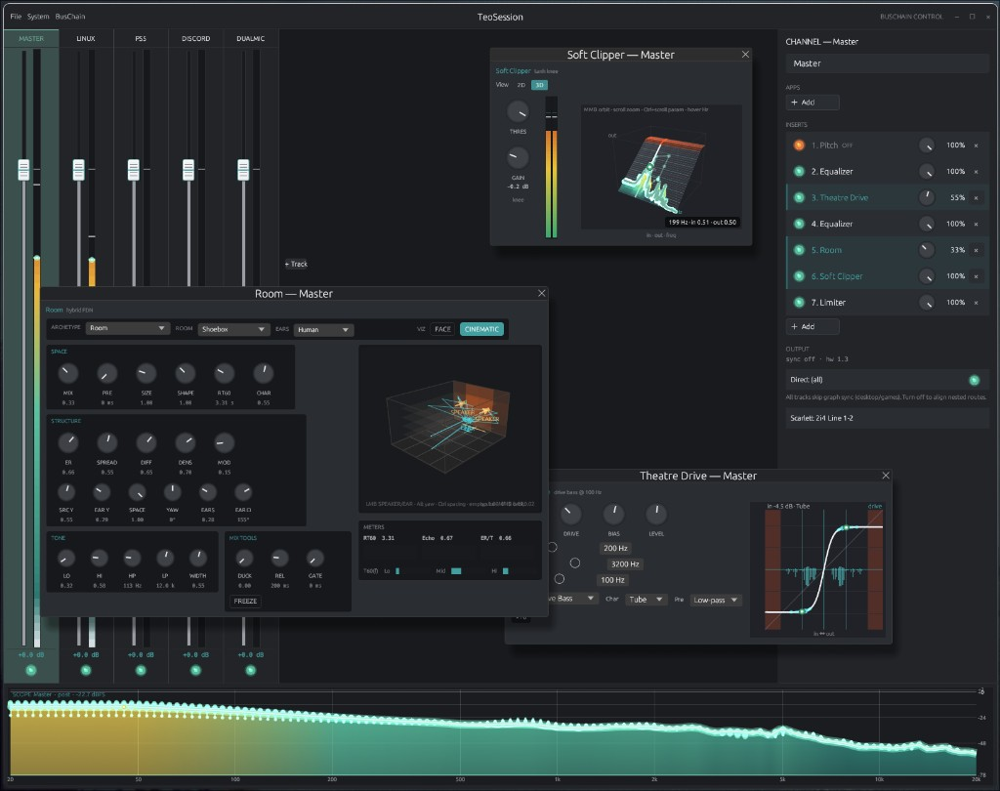
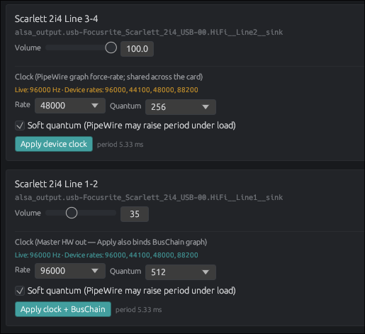
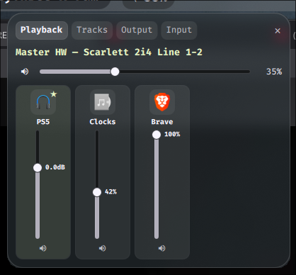
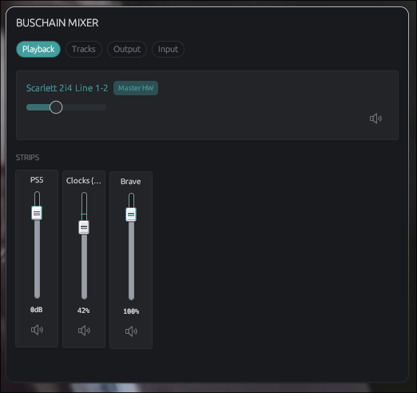

# BusChain Control

<p align="center">
  
</p>

**DAW-grade PipeWire mixer for Linux.** Route apps onto buses, stack insert FX, sync nested tracks when you need phase alignment, run plugins at a higher engine clock than your interface, and keep a named session that survives restarts — without treating system audio like a second-class volume slider.

Closing the window minimizes to the tray. Quit from the tray (or Settings) tears the graph down and restores hardware audio.

**TLDR:** tracks · inserts (builtins + LADSPA / LV2 / CLAP / VST3) · **Direct** / synced Master fan-in · independent BusChain rate & quantum · playback / capture racks · sealed wet path · sticky virtual defaults · MIDI learn · Options (System + BusChain) · Waybar / Quickshell / GTK. Daily driver on PipeWire (Hyprland primary). Details: [`docs/TECHNICAL.md`](docs/TECHNICAL.md).

---

## Who it’s for

- PipeWire users who want a **real mixer** for the desktop, not just per-app sliders
- Hyprland / Wayland rices (Quickshell, Waybar) and general desktops via GTK / egui popup
- Anyone routing browsers, games, Discord, mics, and hardware through per-app buses with FX

**Needs:** PipeWire (+ `pactl`), Wayland session. Optional GTK mixer strip via Nix / package deps.

---

## Install

No official Arch/Debian package yet — use Nix or build from source.

| Distro | Recommended |
|--------|-------------|
| **NixOS** | Flake package + optional Home Manager module |
| **Arch / Debian / Ubuntu** | [Nix](https://nixos.org/download/) profile install, or build from source |

### NixOS

```nix
# flake.nix inputs
{
  inputs.buschain-control.url = "github:teoscloud/buschain-control";
}
```

```nix
environment.systemPackages = [
  inputs.buschain-control.packages.${pkgs.system}.buschain-control
];
# or Home Manager:
# imports = [ inputs.buschain-control.homeModules.buschain-control ];
# services.buschain-control.enable = true;
```

```bash
nix profile install github:teoscloud/buschain-control
```

### Arch / Debian / Ubuntu

**Nix (simplest binaries)**

```bash
nix profile install github:teoscloud/buschain-control
```

<details>
<summary>Build from source (Arch)</summary>

```bash
sudo pacman -S --needed rust cargo pkgconf openssl pipewire \
  libpulse gtk3 gtk-layer-shell python-gobject gobject-introspection \
  alsa-lib freetype2 cairo curl

git clone https://github.com/teoscloud/buschain-control.git
cd buschain-control
make plugins
cargo build --release -p buschain-control -p buschain-tools

mkdir -p ~/.local/bin
cp target/release/buschain-control target/release/buschain-ctl ~/.local/bin/
cp packaging/waybar/buschain-waybar packaging/mixer/buschain-mixer-gtk \
  packaging/scroll-strip/buschain-scroll-strip ~/.local/bin/
chmod +x ~/.local/bin/buschain-*
```

</details>

<details>
<summary>Build from source (Debian / Ubuntu)</summary>

```bash
sudo apt update
sudo apt install -y build-essential pkg-config libssl-dev \
  libpipewire-0.3-dev libpulse-dev libgtk-3-dev libgtk-layer-shell-dev \
  python3-gi gir1.2-gtk-3.0 gir1.2-gtklayershell-0.1 \
  libasound2-dev libfreetype6-dev libcairo2-dev libcurl4-openssl-dev

curl --proto '=https' --tlsv1.2 -sSf https://sh.rustup.rs | sh
source "$HOME/.cargo/env"

git clone https://github.com/teoscloud/buschain-control.git
cd buschain-control
make plugins
cargo build --release -p buschain-control -p buschain-tools

mkdir -p ~/.local/bin
cp target/release/buschain-control target/release/buschain-ctl ~/.local/bin/
cp packaging/waybar/buschain-waybar packaging/mixer/buschain-mixer-gtk \
  packaging/scroll-strip/buschain-scroll-strip ~/.local/bin/
chmod +x ~/.local/bin/buschain-*
```

</details>

Use a current PipeWire session (`pipewire` + `pipewire-pulse`).

### From this checkout

```bash
cd buschain-control
nix develop
cargo run -- --hidden    # tray + graph + IPC
```

---

## First run

```bash
buschain-control --hidden
```

| Action | What happens |
|--------|----------------|
| Close window | Minimize to tray (graph stays up) |
| Tray left-click | Compact mixer popup (**QS → GTK → egui**) |
| Tray right-click → **Open BusChain Control** | Full mixer |
| Tray → Quit | Tear down graph + restore HW default |
| `buschain-ctl status` / `popup` | CLI status / same popup router |

Disable any old user systemd unit if you used one before:

```bash
systemctl --user disable --now buschain-control 2>/dev/null || true
```

---

## What you’ll use day to day

| Goal | Where |
|------|--------|
| Full mixer + channel rack | Open BusChain Control |
| Assign apps → tracks | **System → Playback** (or drag onto the rack) |
| Capture / mics | **System → Recording** + track **In** rack |
| Hardware speakers / mics clocks | **System → Output / Input** |
| Engine rate & quantum (FX quality) | **BusChain → Settings → Audio** |
| Appearance / themes | **BusChain → Settings → Appearance** |
| MIDI learn | **BusChain → MIDI** |
| Save / load layouts | **BusChain → Sessions** |
| Sync nested Track→Track→Master | Channel rack → **Output** → turn **Direct** off |
| Add / power / mix inserts | Channel rack → **INSERTS** |
| Live spectrum | Bottom **SCOPE** (selected track, post-FX) |

Menus: **File** · **System** · **BusChain**. **Esc** closes Options; **Ctrl+S** saves the session.

### Tips

- **Direct vs sync:** leave **Direct** on for games / desktop latency. Turn it off on stems (and Master) when nested buses should phase-align at Master.
- **Engine vs HW clock:** run inserts hotter than the interface when you want quality headroom; egress (`buschain_rs_out_*`) downsamples to Master HW when they differ.
- **Plugins:** VST3 under `~/.vst3` (or `VST3_PATH`); CLAP under `~/.clap`; LV2 via `LV2_PATH`. Restart after installing new plugins.
- **Sticky default:** set **System default** on a virtual track once — after Quit/reopen, BusChain reasserts that sink and reclaims playback apps.
- **Hollow desktop audio:** `buschain-ctl recover-audio`, or `systemctl --user restart wireplumber` as a blunt recovery.
- **Quiet pavucontrol lists:** helpers use `Audio/Sink/Internal`; optional WirePlumber stamp via `scripts/install-wireplumber-rules.sh`.

---

## Highlights

### Direct Out & synced tracks

Nested **Track → Track → Master** routes can be delay-compensated at the Master edge (**GLC**) so buses stay phase-aligned instead of combing. Each track (and Master) has a **Direct** toggle:

- **On** (default) — low-latency send; that stem skips the graph sync pad. Master Direct disables sync globally.
- **Off** — enable Master fan-in sync for nested routes; the rack shows path / fx / pad / hw timing for the selected track.

New buses inherit Master’s current Direct state. Contract: [`docs/TECHNICAL.md`](docs/TECHNICAL.md).

### Separated device & engine clocks

| Clock | Where | Drives |
|-------|--------|--------|
| **Hardware** | System → Output / Input | Speakers / mics — force-rate, quantum, soft-quantum |
| **BusChain engine** | BusChain → Settings → Audio | Tracks, inserts, Master bus (up through DXD 352.8 / 384 kHz) |

**Master HW Apply** force-rates speakers only. Other devices use **Apply device clock** without forcing the whole graph.

<p align="center">
  
</p>

### Mixer, FX & scope

- Dynamic tracks with gain, mute jewels, phosphor meters, and a post-FX **SCOPE** for the selected track
- Channel rack: apps, inserts (power / wet Mix / reorder), Direct, outputs
- **Builtins** — EQ, Theatre Drive, Room, Soft Clipper, limiter, denoiser, pitch, and more (with live viz)
- **Hosted** — LADSPA, LV2, CLAP, VST3 (in-process DSP; optional SHM sandbox; VST3 editors via `buschain-plugin-surface`)
- Sealed wet path: `{bus}.monitor → buschain_fx_* → buschain_post_* → [glc δ?] → Master / tracks / HW`

### Compact mixer — Quickshell rice & default egui

Popup order is **Quickshell → GTK → egui**.

<table>
  <tr>
    <td align="center" width="50%">
      <br />
      <em>Quickshell rice</em> — same IPC contract, your panel styling
    </td>
    <td align="center" width="50%">
      <br />
      <em>Default egui mixer</em> — ships with the app, no rice required
    </td>
  </tr>
</table>

```conf
# ~/.config/hypr/hyprland.conf
exec-once = buschain-control --hidden
env = BUSCHAIN_CONTROL_QS_MIXER,1
env = BUSCHAIN_CONTROL_QS_STRIP,1
```

Waybar: [`packaging/waybar/module.jsonc`](packaging/waybar/module.jsonc) — **no** `on-scroll-*` (scroll belongs to the QS/GTK strip).  
QS contract: [`docs/HANDOVER-QUICKSHELL.md`](docs/HANDOVER-QUICKSHELL.md) · stubs in [`packaging/quickshell/`](packaging/quickshell/).

```bash
export BUSCHAIN_CONTROL_USE_GTK_MIXER=0   # force egui popup
export BUSCHAIN_CONTROL_SCROLL_STRIP=1    # opt-in GTK Master HW strip
```

### Sessions, MIDI & shell

- Named sessions under `~/.config/buschain-control/` with soft HW rebind
- MIDI devices, routes, and CC learn → insert parameters
- Themes under Settings → Appearance (`~/.config/buschain-control/themes/`)

### Project state

| Area | Status |
|------|--------|
| Mixer, routing, virtual I/O, sessions | Stable |
| Built-in + hosted inserts / VST3 editors | Usable daily; host APIs still deepening |
| Direct / GLC sync, engine↔HW clocks | Stable for daily use |
| Compact popup (QS / GTK / egui) | Stable |
| Distro packages (Arch/Debian repos) | Not yet — Nix or source |
| Crash / `kill -9` audio restore | Still open (Quit path is solid) |

---

## Docs

| Doc | Audience |
|-----|----------|
| [`docs/TECHNICAL.md`](docs/TECHNICAL.md) | Features detail, binaries, Waybar, env reference |
| [`docs/ARCHITECTURE.md`](docs/ARCHITECTURE.md) | Live graph / engine contract |
| [`docs/HANDOVER-QUICKSHELL.md`](docs/HANDOVER-QUICKSHELL.md) | Quickshell rice contract |
| [`docs/ROADMAP.md`](docs/ROADMAP.md) | Done / planned work |

---

## License

MIT — see [`LICENSE`](LICENSE).
